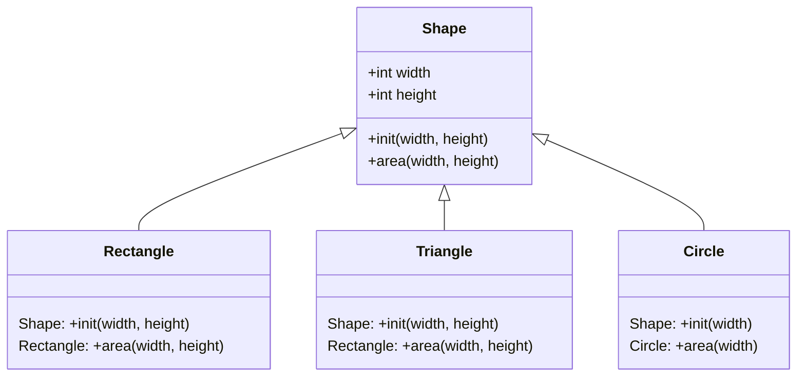

```mermaid
classDiagram
    Shape <|-- Rectangle
    Shape <|-- Triangle
    Shape <|-- Circle
    Shape: +init(width, height) 
    Shape : +int width
    Shape : +int height
    Shape: +area(width, height)
    class Rectangle {
        Shape: +init(width, height)
        Rectangle: +area(width, height)
    }
    class Triangle {
        Shape: +init(width, height)
        Rectangle: +area(width, height)
    }
    class Circle {
        Shape: +init(width)
        Circle: +area(width)
    }
```            